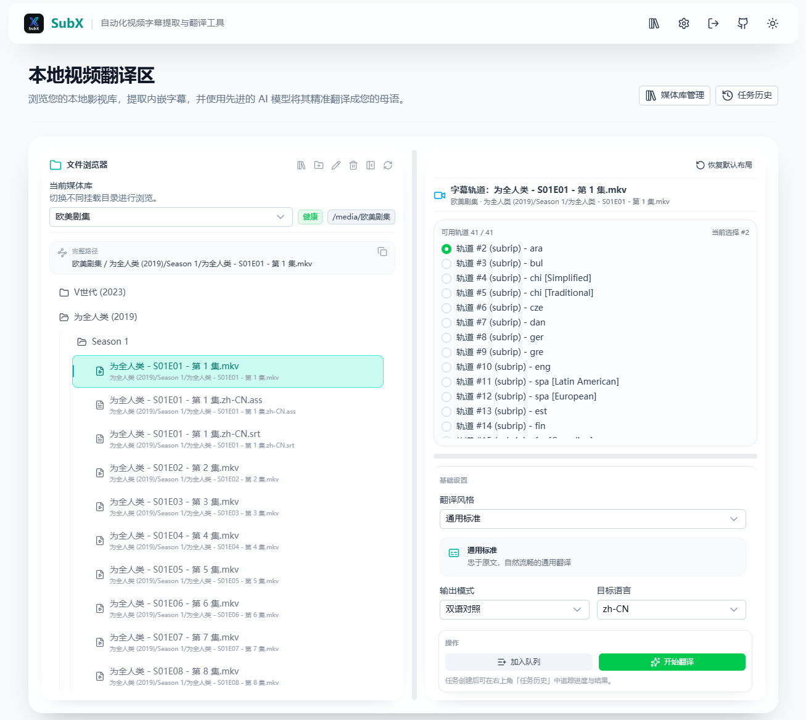

# SubX

> 说明：本仓库基于原作者项目 Fork，并在部署、界面与工程化方面做了适配与增强。核心能力与设计思路归功于原作者，在此感谢原作者的开源贡献。

SubX 是一款面向本地 / 私有云环境的 AI 字幕提取与翻译工具。

它可以扫描本地媒体目录，读取视频中的内嵌字幕轨道或外挂字幕文件，并调用大语言模型完成翻译，最终导出 `srt`、`ass` 或两者同时输出的字幕文件。

## 🌟 当前版本特性

- **字幕来源支持完整**：支持视频内嵌字幕轨道提取，以及 `.srt`、`.ass`、`.ssa`、`.vtt` 等外挂字幕读取。
- **输出模式灵活**：支持仅译文、双语对照、仅导出原字幕。
- **导出格式可选**：支持导出 `srt`、`ass` 或同时导出两种格式。
- **ASS 导出更稳**：对原始 `ass/ssa` 字幕优先保留原时间轴并重写文本，降低样式丢失和时间偏移风险。
- **多媒体库管理**：支持多个容器内媒体根目录，可设置默认库、顺序、启用状态，并支持单个/批量检测。
- **文件浏览器优化**：支持目录展开状态记忆、自动展开当前选中文件的父级目录链、长路径折叠与一键复制。
- **任务历史更易用**：支持查看详情、下载字幕、失败任务重试、长路径折叠展开与完整路径复制。
- **口令登录保护**：首次启动设置访问口令，后续页面与 API 访问均需登录。
- **Docker 友好**：适合 NAS、家庭服务器和云主机，通过目录挂载直接处理本地媒体文件。

## 🖼️ 界面示例



## 📥 部署方式

### 🐳 Docker（推荐）

#### 1) 快速可用版（复制即用）

快速跳转：

- [单目录模式](#4-docker-compose-参考示例)
- [多媒体库配置](#-多媒体库配置)

```yaml
services:
  subx:
    image: ghcr.io/marod1m/subx:v1.0.5
    container_name: subx
    restart: unless-stopped
    ports:
      - "3000:3000"
    environment:
      TZ: Asia/Shanghai
      VIDEO_DIR: /media
      DB_PATH: /app/db/subx.db
    volumes:
      - /path/to/your/media:/media
      - ./data/db:/app/db
      - ./data/temp:/app/temp
```

启动：

```bash
docker compose up -d
```

访问：

- `http://<你的主机IP>:3000`

---

#### 2) 长期运行版（健康检查 + 日志轮转）

```yaml
services:
  subx:
    image: ghcr.io/marod1m/subx:v1.0.5
    container_name: subx
    restart: unless-stopped
    ports:
      - "3000:3000"
    environment:
      TZ: Asia/Shanghai
      VIDEO_DIR: /media
      DB_PATH: /app/db/subx.db
    volumes:
      - /path/to/your/media:/media
      - ./data/db:/app/db
      - ./data/temp:/app/temp
    healthcheck:
      test: ["CMD-SHELL", "wget -q -O - http://127.0.0.1:3000/login >/dev/null 2>&1 || exit 1"]
      interval: 30s
      timeout: 5s
      retries: 5
      start_period: 30s
    logging:
      driver: json-file
      options:
        max-size: "10m"
        max-file: "3"
```

常用命令：

```bash
docker compose pull && docker compose up -d
docker compose logs -f subx
docker compose restart subx
docker compose down
```

---

#### 3) NAS 路径示例

群晖：

```yaml
volumes:
  - /volume1/video:/media
  - /volume1/docker/subx/db:/app/db
  - /volume1/docker/subx/temp:/app/temp
```

Unraid：

```yaml
volumes:
  - /mnt/user/Media:/media
  - /mnt/user/appdata/subx/db:/app/db
  - /mnt/user/appdata/subx/temp:/app/temp
```

---

#### 4) `docker-compose` 参考示例

**单目录模式**

```yaml
services:
  subx:
    image: ghcr.io/marod1m/subx:latest
    container_name: subx
    restart: unless-stopped
    ports:
      - "3000:3000"
    environment:
      TZ: Asia/Shanghai
      VIDEO_DIR: /media
      DB_PATH: /app/db/subx.db
    volumes:
      - /volume1/video:/media
      - ./data/db:/app/db
      - ./data/temp:/app/temp
    healthcheck:
      test: ["CMD-SHELL", "wget -q -O - http://127.0.0.1:3000/login >/dev/null 2>&1 || exit 1"]
      interval: 30s
      timeout: 5s
      retries: 5
      start_period: 30s
```

适用场景：

- 所有媒体都在同一个目录
- 继续沿用 `VIDEO_DIR` 模式
- 希望升级时改动最小

**多媒体库模式**

```yaml
services:
  subx:
    image: ghcr.io/marod1m/subx:latest
    container_name: subx
    restart: unless-stopped
    ports:
      - "3000:3000"
    environment:
      TZ: Asia/Shanghai
      VIDEO_DIR: /media/movies
      DB_PATH: /app/db/subx.db
    volumes:
      - /volume1/movies:/media/movies
      - /volume1/tv:/media/tv
      - /volume2/anime:/media/anime
      - ./data/db:/app/db
      - ./data/temp:/app/temp
    healthcheck:
      test: ["CMD-SHELL", "wget -q -O - http://127.0.0.1:3000/login >/dev/null 2>&1 || exit 1"]
      interval: 30s
      timeout: 5s
      retries: 5
      start_period: 30s
```

配置后，请到 `媒体库管理` 页面添加以下容器内路径：

- `/media/movies`
- `/media/tv`
- `/media/anime`

注意：

- 设置页面里填写的是**容器内路径**，不要写宿主机路径。
- 多媒体库模式下，仍建议保留一个有效的 `VIDEO_DIR` 作为兼容回退值。
- 如果首页提示媒体库不可访问，请优先检查卷挂载、目录权限和路径拼写。

## 🚀 首次使用流程

1. **首次访问页面**：打开服务地址后，先设置访问口令。
2. **完成登录**：口令设置完成后，使用该口令登录系统。
3. **进入媒体库管理**：点击首页右上角的 `媒体库管理`。
4. **添加媒体库**：填写一个或多个容器内路径，例如 `/media`、`/media/movies`。
5. **执行路径检测**：建议先做单个检测或批量检测，确认挂载和权限正常。
6. **保存配置**：保存成功后返回首页。
7. **开始翻译**：在首页文件浏览器中选择视频、字幕轨道和翻译参数，创建任务。
8. **查看结果**：在 `任务历史` 中查看详情、下载字幕或重试失败任务。

## 📚 多媒体库配置

### 1) 三个路径概念

请区分以下内容：

- **宿主机路径**：例如 `/volume1/video`
- **容器内路径**：例如 `/media` 或 `/media/movies`
- **应用扫描路径**：SubX 最终使用的路径，始终是**容器内路径**

例如：

- 宿主机路径：`/volume1/video`
- Docker 挂载：`/volume1/video:/media`
- 应用扫描路径：`/media`

这时：

- `VIDEO_DIR` 应写 `/media`
- 媒体库管理页面也应写 `/media`
- 不能写 `/volume1/video`

### 2) 兼容旧部署

如果你没有在“媒体库管理”页面配置任何媒体库，系统会自动使用环境变量 `VIDEO_DIR` 对应的目录作为默认媒体目录。

### 3) 推荐操作顺序

1. 先完成 Docker 目录挂载
2. 打开 `媒体库管理`
3. 添加一个或多个媒体库
4. 执行单个检测或批量检测
5. 确认正常后保存
6. 返回首页开始浏览和翻译

### 4) 当前媒体库管理页支持的能力

- 设置显示名称
- 设置容器内路径
- 启用 / 停用媒体库
- 设置默认媒体库
- 调整媒体库顺序
- 单个检测路径
- 批量检测路径
- 允许带无效媒体库强制保存

## 📝 字幕导出说明

- `srt` 导出直接基于规范化后的字幕条目生成。
- `ass` 导出会优先复用原始 `ass/ssa` 时间轴与事件结构，只重写字幕文本。
- 若原始来源不是 `ass/ssa`，系统会按统一模板生成 `ass` 文件。
- 输出文件会按你在设置中的字幕格式选项写入同目录。

## ⚠️ 部署与使用注意事项

### 1) 登录与反向代理

首次访问未登录时，页面会跳转到：

- `/login`

如果你使用 DDNS、Nginx、Traefik、宝塔或 NAS 自带反向代理，请确保：

- 页面路由正常转发
- `/api/*` 正常转发
- `/_nuxt/*` 静态资源正常转发
- 透传 `X-Forwarded-Proto: https`
- 不缓存 `/` 和 `/login`

否则可能出现：

- 首次访问不跳登录页
- 登录状态异常
- 页面可访问但接口失败
- 前端资源加载不完整

### 2) 首页提示“当前媒体库暂不可访问”

优先排查：

- Docker 挂载是否正确
- 页面填写的是否为容器内路径
- 容器用户是否有读取权限
- 该目录是否真实存在
- 填写的是目录而不是文件路径

### 3) 任务失败时优先检查

- API Key、模型名、Base URL 是否正确
- 模型服务是否可从容器内访问
- 媒体库路径是否可读
- 任务详情中的错误日志与原始响应
- 容器日志 `docker compose logs -f subx`

## ❓ 常见问题

### 为什么页面能打开，但看不到文件？

- 先检查挂载路径是否正确。
- 检查 `VIDEO_DIR` 或媒体库路径是否与容器内实际路径一致。
- 如使用多媒体库，确认在 `媒体库管理` 页面填写的是容器内路径。

### 为什么设置里填宿主机路径不生效？

- 因为应用运行在容器中，程序无法直接读取宿主机路径。
- 你需要填写挂载后的容器内路径，例如 `/media/tv`。

### 为什么会提示权限不足？

- 容器运行用户对媒体目录或数据库目录没有读写权限。
- 可先临时用更高权限验证，再回到最小权限部署。

### 升级后会丢数据吗？

- 只要 `DB_PATH` 对应的数据目录持续挂载，数据库会保留。
- 建议升级方式：`docker compose pull && docker compose up -d`

### GHCR 镜像什么时候构建？

当前仓库已配置 GitHub Actions，在以下情况会触发镜像构建：

- 推送 `master`
- 推送 `v*` 标签

镜像地址：

- `ghcr.io/marod1m/subx:v1.0.5`
- `ghcr.io/marod1m/subx:latest`

## 🛠️ 技术栈

- **前端**：Nuxt 4 + Vue 3
- **UI**：Nuxt UI + Tailwind CSS
- **服务端**：Nitro
- **数据库**：SQLite（`better-sqlite3`）
- **媒体处理**：FFmpeg（`fluent-ffmpeg`）
- **字幕处理**：`ass-compiler`、`srt-parser-2`
- **鉴权相关**：浏览器 Crypto API + Node.js Crypto

## 💻 本地开发

### 1) 环境准备

确保系统已安装：

- Node.js 18+
- FFmpeg / FFprobe

### 2) 可选环境变量

```env
VIDEO_DIR=/absolute/path/to/media
DB_PATH=./db/subx.db
FFMPEG_PATH=/usr/bin/ffmpeg
FFPROBE_PATH=/usr/bin/ffprobe
```

Windows 示例：

```env
VIDEO_DIR=D:\Path\To\Videos
DB_PATH=./db/subx.db
FFMPEG_PATH=C:\ffmpeg\bin\ffmpeg.exe
FFPROBE_PATH=C:\ffmpeg\bin\ffprobe.exe
```

### 3) 启动开发环境

```bash
npm install
npm run dev
```

补充说明：

- 本地开发如需模拟多媒体库，也应按程序实际可访问的路径配置。
- 如果你在 Docker 中做开发，媒体库页面依然要填写容器内路径。

## 📜 许可证

本项目采用 **MIT** 许可证。
